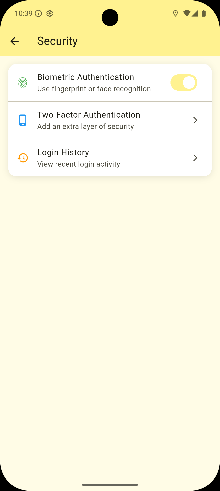

# Restaurant Explorer Nepal

A Flutter app to explore restaurants in Nepal, featuring deep linking and detailed restaurant views.

---

## Requirements

- [Flutter](https://flutter.dev/)
- [Mockoon](https://mockoon.com/) (for local API mocking)

---

## Setup

1. **Clone this repository.**
2. **The `json` folder in the project root contains mock JSON files**  
   These files are used to mock restaurant lists and details.

3. **Start Mockoon and import the provided JSON files:**

   - Open Mockoon.
   - Create a new environment.
   - Import the JSON files from the `json` folder in this repository.
   - Start the Mockoon server.

4. **Update your app's API base URL** (if needed) to point to your local Mockoon server (e.g., `http://localhost:3000`).

---

## Screenshots

### 🔐 Authentication Screens

| Login | Sign Up | Enable Biometric | Native Biometric |
|-------|---------|------------------|------------------|
|  |  |  |  |

---

### 🍽️ Explore Screen

| Explore | Explore Search | Sort |
|---------|----------------|------|
|  |  |  |

---

### ❤️ Favorites Screen

| Favorites | Sort By |
|-----------|---------|
|  |  |

---

### 👤 Account Screen

| Account Main | Change Password | Security |
|--------------|------------------|----------|
|  |  |  |

---

### 🗺️ Map View

| Nearby Restaurants Map |
|------------------------|
|  |

---

### 📄 Detail Pages

| Detail Page Top | Detail Page Bottom |
|-----------------|--------------------|
|  |  |

---

## Features

- List restaurants (data from Mockoon JSON).
- View detailed restaurant info.
- Deep link support.

---

## Notes

- The app requires the Mockoon server running with the JSON data provided in the `json` folder to display restaurant lists and details.
- Deep links will navigate directly to restaurant details if the app is running.
